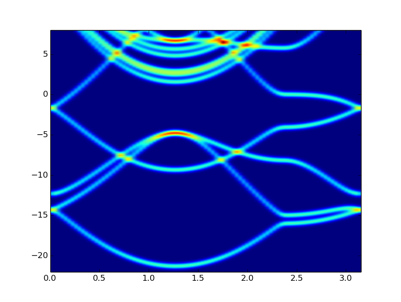

# pyUnfoldFormat.py

## Description
Meant as a utility to help with understanding folded band structure as produced by the Quantum Espresso utility unfold-x (over on Gitorious). I have tested this with the graphene example which produced the following image:

I highly suggest that you create your own convolution (smoothKernel) matrix, because this was just a quick test. Also, this script does not account for spin in the binary file, so it will probably be a later addition.
